# Qiskit Machine Learning For eX3, Sigma2, and VLQ
[](https://arxiv.org/abs/2505.17756)

<!--- long-description-skip-end -->

## What is Qiskit Machine Learning for ex3, Sigma2, and VLQ?

This is a fork of IBM's original Qiskit Machine Learning Library that is adapted to run on ex3, sigma2, and VLQ. It provides all the functionality of original qiskit machine learning library and in addition provided interfaces for estimators and samplers that utilizes gpu on ex3, sigma2 and can use VLQ real quantum computer. 

Qiskit Machine Learning introduces fundamental computational building blocks, such as Quantum 
Kernels and Quantum Neural Networks, used in various applications including classification 
and regression. The Qiskit machine learning library is part of the Qiskit Community ecosystem, a collection of high-level codes that are based
on the Qiskit software development kit.

> [!NOTE]
> A description of the original library structure, features, and domain-specific applications, can be found 
> in a dedicated [ArXiv paper](https://arxiv.org/abs/2505.17756).

The Qiskit Machine Learning framework aims to be:

* **User-friendly**, allowing users to quickly and easily prototype quantum machine learning models without 
    the need of extensive quantum computing knowledge.
* **Flexible**, providing tools and functionalities to conduct proof-of-concepts and innovative research 
    in quantum machine learning for both beginners and experts.
* **Extensible**, facilitating the integration of new cutting-edge features leveraging Qiskit's 
    architectures, patterns and related services.


## What are the main features of Qiskit Machine Learning?

### Kernel-based methods

The FidelityQuantumKernel class uses the Fidelity algorithm. It computes kernel matrices for datasets and can be combined with a Quantum Support Vector Classifier (QSVC) 
or a Quantum Support Vector Regressor (QSVR) to solve classification or regression problems respectively. It is also compatible with classical kernel-based machine learning algorithms.


### Quantum Neural Networks (QNNs)

Qiskit Machine Learning defines a generic interface for neural networks, implemented by two core (derived) primitives:

- EstimatorQNN, combining parametrized quantum circuits with Z-pauli quantum observables. The output is the expected value of the Z observable.
  
- SamplerQNN, translating bit-string counts into the desired outputs.

To train and use neural networks, Qiskit Machine Learning provides learning algorithms such as the NeuralNetworkClassifier and NeuralNetworkRegressor.
Finally, built on these, the Variational Quantum Classifier (VQC) and the Variational Quantum Regressor (VQR),
take a _feature map_ and an _ansatz_ to construct the underlying QNN automatically using high-level syntax.

### Integration with PyTorch

The [`TorchConnector`](https://qiskit-community.github.io/qiskit-machine-learning/stubs/qiskit_machine_learning.connectors.TorchConnector.html#qiskit_machine_learning.connectors.TorchConnector) 
integrates QNNs with [PyTorch](https://pytorch.org). 
Thanks to the gradient algorithms in Qiskit Machine Learning, this includes automatic differentiation. 
The overall gradients computed by PyTorch during the backpropagation take into account quantum neural 
networks, too. The flexible design also allows the building of connectors to other packages in the future.

## Installation and documentation
```bash
git clone
cd QNRI-machine-learning
pip install .
```

### Optional Installs

* **PyTorch** may be installed either using command `pip install 'qiskit-machine-learning[torch]'` to install the
  package or refer to PyTorch [getting started](https://pytorch.org/get-started/locally/). When PyTorch
  is installed, the `TorchConnector` facilitates its use of quantum computed networks.

* **Sparse** may be installed using command `pip install 'qiskit-machine-learning[sparse]'` to install the
  package. Sparse being installed will enable the usage of sparse arrays and tensors.

* **NLopt** is required for the global optimizers. [`NLopt`](https://nlopt.readthedocs.io/en/latest/) 
  can be installed manually with `pip install nlopt` on Windows and Linux platforms, or with `brew 
  install nlopt` on MacOS using the Homebrew package manager. For more information, 
  refer to the [installation guide](https://nlopt.readthedocs.io/en/latest/NLopt_Installation/).

----------------------------------------------------------------------------------------------------
There are several algorithms in this library, for the sake of demo, here we show a simple task of classification and regression for ex3, sigma2, and VLQ.

# Neural Network Classifier & Regressor
In this tutorial we show how the `NeuralNetworkClassifier` and
`NeuralNetworkRegressor` are used. Both take as an input a (Quantum)
`NeuralNetwork` and leverage it in a specific context. In both cases we
also provide a pre-configured variant for convenience, the Variational
Quantum Classifier (`VQC`) and Variational Quantum Regressor (`VQR`).
The tutorial is structured as follows:

1.  [Classification](#Classification) Ex3, Sigma2, VLQ
    -   Classification with an `EstimatorQNN`
    -   Classification with a `SamplerQNN`
    -   Variational Quantum Classifier (`VQC`)
2.  [Regression](#Regression) Ex3, Sigma2, VLQ
    -   Regression with an `EstimatorQNN`
    -   Variational Quantum Regressor (`VQR`)

``` python
import matplotlib.pyplot as plt
import numpy as np
from IPython.display import clear_output
from qiskit import QuantumCircuit
from qiskit.circuit import Parameter
from qiskit.circuit.library import RealAmplitudes, ZZFeatureMap
from qiskit_machine_learning.optimizers import COBYLA, L_BFGS_B
from qiskit_machine_learning.utils import algorithm_globals

from qiskit_machine_learning.algorithms.classifiers import NeuralNetworkClassifier, VQC
from qiskit_machine_learning.algorithms.regressors import NeuralNetworkRegressor, VQR
from qiskit_machine_learning.neural_networks import SamplerQNN, EstimatorQNN
from qiskit_machine_learning.circuit.library import QNNCircuit

algorithm_globals.random_seed = 42
```
## Classification

We prepare a simple classification dataset to illustrate the following
algorithms.
``` python
num_inputs = 2
num_samples = 20
X = 2 * algorithm_globals.random.random([num_samples, num_inputs]) - 1
y01 = 1 * (np.sum(X, axis=1) >= 0)  # in { 0,  1}
y = 2 * y01 - 1  # in {-1, +1}
y_one_hot = np.zeros((num_samples, 2))
for i in range(num_samples):
    y_one_hot[i, y01[i]] = 1

for x, y_target in zip(X, y):
    if y_target == 1:
        plt.plot(x[0], x[1], "bo")
    else:
        plt.plot(x[0], x[1], "go")
plt.plot([-1, 1], [1, -1], "--", color="black")
plt.show()
```

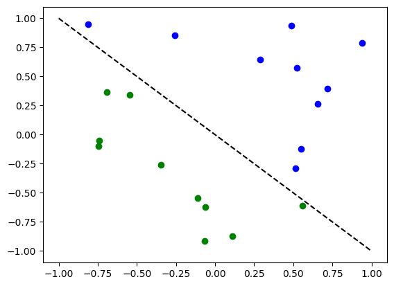

### Classification with an `EstimatorQNN`

First we show how an `EstimatorQNN` can be used for classification
within a `NeuralNetworkClassifier`. In this context, the `EstimatorQNN`
is expected to return one-dimensional output in $[-1, +1]$. This only
works for binary classification and we assign the two classes to
$\{-1, +1\}$. To simplify the composition of parameterized quantum
circuit from a feature map and an ansatz we can use the `QNNCircuit`
class.

``` python
# construct QNN with the QNNCircuit's default ZZFeatureMap feature map and RealAmplitudes ansatz.
qc = QNNCircuit(num_qubits=2)
qc.draw("mpl", style="clifford")
```

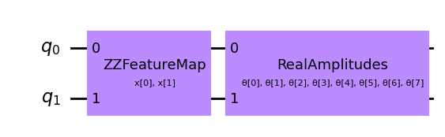

Create a quantum neural network with estimator combatible with Ex3, Sigma, and VLQ.
we will set the `estimator` parameter based on the target system from `QNRIEstimator.py`.
### For Ex3, Sigma we can use Aer_Estimator
``` python
from QNRIEstimator import Aer_Estimator
backend_options = {
        "method": "statevector",
        "noise_model": None,
        "shots": 2024,
        "device": "GPU",
        "blocking_enable":True,
        "batched_shots_gpu":True,
        "seed_simulator": 42,
    }

estimator = Aer_Estimator(options=dict(backend_options=backend_options))
```
### for VLQ we can use VLQ_Estimator
```python
from QNRIEstimator import VLQ_Estimator

estimator = VLQ_Estimator(lexis_project= "vlq_demo_project", resource_name = "qaas_user", shots = 2024)

estimator_qnn = EstimatorQNN(circuit=qc, estimator=estimator)
```

We will add a callback function called `callback_graph`. This will be
called for each iteration of the optimizer and will be passed two
parameters: the current weights and the value of the objective function
at those weights. For our function, we append the value of the objective
function to an array so we can plot iteration versus objective function
value and update the graph with each iteration. However, you can do
whatever you want with a callback function as long as it gets the two
parameters mentioned passed.

``` python
# callback function that draws a live plot when the .fit() method is called
def callback_graph(weights, obj_func_eval):
    clear_output(wait=True)
    objective_func_vals.append(obj_func_eval)
    plt.title("Objective function value against iteration")
    plt.xlabel("Iteration")
    plt.ylabel("Objective function value")
    plt.plot(range(len(objective_func_vals)), objective_func_vals)
    plt.show()
```
``` python
# construct neural network classifier
estimator_classifier = NeuralNetworkClassifier(
    estimator_qnn, optimizer=COBYLA(maxiter=60), callback=callback_graph
)
```
``` python
# create empty array for callback to store evaluations of the objective function
objective_func_vals = []
plt.rcParams["figure.figsize"] = (12, 6)

# fit classifier to data
estimator_classifier.fit(X, y)

# return to default figsize
plt.rcParams["figure.figsize"] = (6, 4)

# score classifier
estimator_classifier.score(X, y)
```


    0.8

``` python
# evaluate data points
y_predict = estimator_classifier.predict(X)

# plot results
# red == wrongly classified
for x, y_target, y_p in zip(X, y, y_predict):
    if y_target == 1:
        plt.plot(x[0], x[1], "bo")
    else:
        plt.plot(x[0], x[1], "go")
    if y_target != y_p:
        plt.scatter(x[0], x[1], s=200, facecolors="none", edgecolors="r", linewidths=2)
plt.plot([-1, 1], [1, -1], "--", color="black")
plt.show()
```

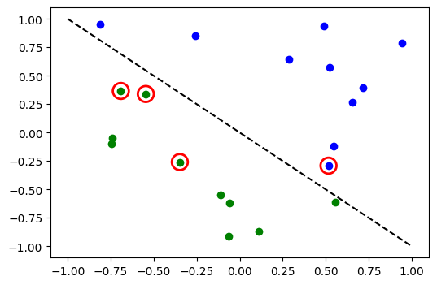

Now, when the model is trained, we can explore the weights of the neural
network. Please note, the number of weights is defined by ansatz.

``` python
estimator_classifier.weights
```


    array([ 0.86209107, -1.06526254, -0.10663602, -0.39086371,  1.0894299 ,
            0.59368219,  2.22731471, -1.04769663])

### Classification with a `SamplerQNN`

Next we show how a `SamplerQNN` can be used for classification within a
`NeuralNetworkClassifier`. In this context, the `SamplerQNN` is expected
to return $d$-dimensional probability vector as output, where $d$
denotes the number of classes. The underlying `Sampler` primitive
returns quasi-distributions of bit strings and we just need to define a
mapping from the measured bitstrings to the different classes. For
binary classification we use the parity mapping. Again we can use the
`QNNCircuit` class to set up a parameterized quantum circuit from a
feature map and ansatz of our choice. 

For Sampler we use  `QNRISampler.py` (`Aer_Sampler`, or `VLQ_Sampler`).

``` python
# construct a quantum circuit from the default ZZFeatureMap feature map and a customized RealAmplitudes ansatz
qc = QNNCircuit(ansatz=RealAmplitudes(num_inputs, reps=1))
qc.draw("mpl", style="clifford")
```


``` python
# parity maps bitstrings to 0 or 1
def parity(x):
    return "{:b}".format(x).count("1") % 2


output_shape = 2  # corresponds to the number of classes, possible outcomes of the (parity) mapping.
```
### For ex3, Sigma2 we use Aer_Sampler
``` python
from QNRISampler import Aer_Sampler
backend_options = {
        "method": "statevector",
        "noise_model": None,
        "shots": 2024,
        "device": "GPU",
        "blocking_enable":True,
        "batched_shots_gpu":True,
        "seed_simulator": 42,
    }

sampler = Aer_Sampler(options=dict(backend_options=backend_options))
```
### For VLQ we use VLQ_Sampler
```python
from QNRISampler import VLQ_Sampler

sampler = VLQ_Sampler(lexis_project= "vlq_demo_project", resource_name = "qaas_user", shots = 2024)
```
```python
# construct QNN
sampler_qnn = SamplerQNN(
    circuit=qc,
    interpret=parity,
    output_shape=output_shape,
    sampler=sampler,
)
```
``` python
# construct classifier
sampler_classifier = NeuralNetworkClassifier(
    neural_network=sampler_qnn, optimizer=COBYLA(maxiter=30), callback=callback_graph
)
```
``` python
# create empty array for callback to store evaluations of the objective function
objective_func_vals = []
plt.rcParams["figure.figsize"] = (12, 6)

# fit classifier to data
sampler_classifier.fit(X, y01)

# return to default figsize
plt.rcParams["figure.figsize"] = (6, 4)

# score classifier
sampler_classifier.score(X, y01)
```

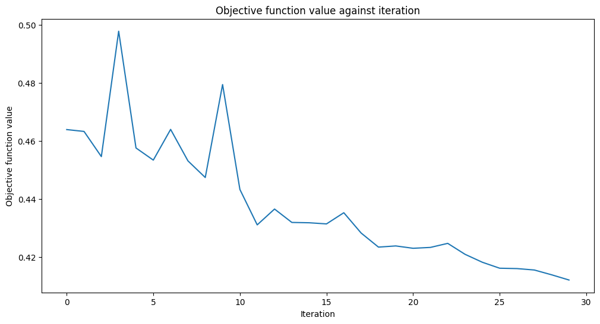
    0.7
``` python
# evaluate data points
y_predict = sampler_classifier.predict(X)

# plot results
# red == wrongly classified
for x, y_target, y_p in zip(X, y01, y_predict):
    if y_target == 1:
        plt.plot(x[0], x[1], "bo")
    else:
        plt.plot(x[0], x[1], "go")
    if y_target != y_p:
        plt.scatter(x[0], x[1], s=200, facecolors="none", edgecolors="r", linewidths=2)
plt.plot([-1, 1], [1, -1], "--", color="black")
plt.show()
```

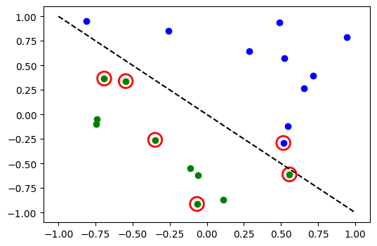

Again, once the model is trained we can take a look at the weights. As
we set `reps=1` explicitly in our ansatz, we can see less parameters
than in the previous model.
``` python
sampler_classifier.weights
```

    array([ 1.67198565,  0.46045402, -0.93462862, -0.95266092])

### Variational Quantum Classifier (`VQC`)

The `VQC` is a special variant of the `NeuralNetworkClassifier` with a
`SamplerQNN`. It applies a parity mapping (or extensions to multiple
classes) to map from the bitstring to the classification, which results
in a probability vector, which is interpreted as a one-hot encoded
result. By default, it applies this the `CrossEntropyLoss` function that
expects labels given in one-hot encoded format and will return
predictions in that format too.

``` python
# construct feature map, ansatz, and optimizer
feature_map = ZZFeatureMap(num_inputs)
ansatz = RealAmplitudes(num_inputs, reps=1)

# construct variational quantum classifier
vqc = VQC(
    feature_map=feature_map,
    ansatz=ansatz,
    loss="cross_entropy",
    optimizer=COBYLA(maxiter=30),
    callback=callback_graph,
    sampler=sampler,
)
```
``` python
# create empty array for callback to store evaluations of the objective function
objective_func_vals = []
plt.rcParams["figure.figsize"] = (12, 6)

# fit classifier to data
vqc.fit(X, y_one_hot)

# return to default figsize
plt.rcParams["figure.figsize"] = (6, 4)

# score classifier
vqc.score(X, y_one_hot)
```

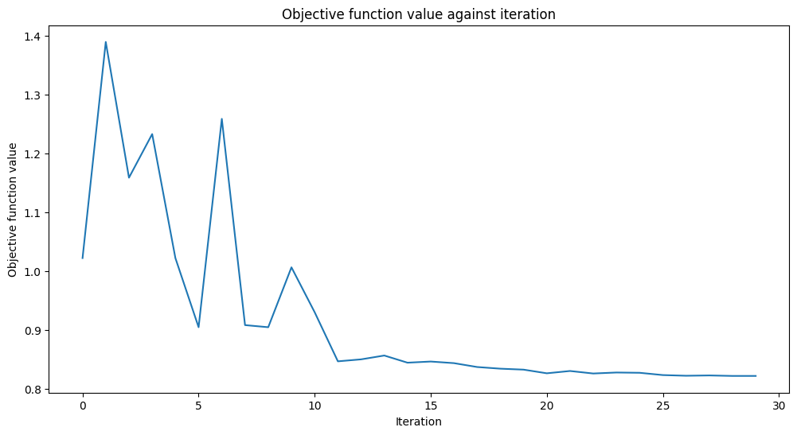
    0.8

``` python
# evaluate data points
y_predict = vqc.predict(X)

# plot results
# red == wrongly classified
for x, y_target, y_p in zip(X, y_one_hot, y_predict):
    if y_target[0] == 1:
        plt.plot(x[0], x[1], "bo")
    else:
        plt.plot(x[0], x[1], "go")
    if not np.all(y_target == y_p):
        plt.scatter(x[0], x[1], s=200, facecolors="none", edgecolors="r", linewidths=2)
plt.plot([-1, 1], [1, -1], "--", color="black")
plt.show()
```

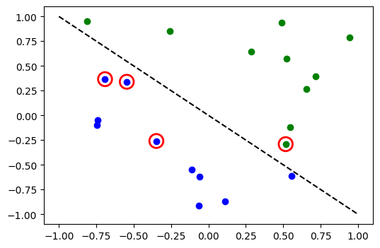

### Multiple classes with VQC

In this section we generate an artificial dataset that contains samples
of three classes and show how to train a model to classify this dataset.
This example shows how to tackle more interesting problems in machine
learning. Of course, for a sake of short training time we prepare a tiny
dataset. We employ `make_classification` from SciKit-Learn to generate a
dataset. There 10 samples in the dataset, 2 features, that means we can
still have a nice plot of the dataset, as well as no redundant features,
these are features are generated as a combinations of the other
features. Also, we have 3 different classes in the dataset, each classes
one kind of centroid and we set class separation to `2.0`, a slight
increase from the default value of `1.0` to ease the classification
problem.

Once the dataset is generated we scale the features into the range
`[0, 1]`.

``` python
from sklearn.datasets import make_classification
from sklearn.preprocessing import MinMaxScaler

X, y = make_classification(
    n_samples=10,
    n_features=2,
    n_classes=3,
    n_redundant=0,
    n_clusters_per_class=1,
    class_sep=2.0,
    random_state=algorithm_globals.random_seed,
)
X = MinMaxScaler().fit_transform(X)
```
Let\'s see how our dataset looks like.

``` python
plt.scatter(X[:, 0], X[:, 1], c=y)
```

    <matplotlib.collections.PathCollection at 0x7ff6fbcf2110>

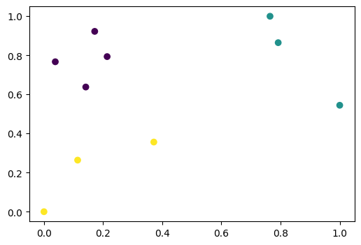

We also transform labels and make them categorical.
``` python
y_cat = np.empty(y.shape, dtype=str)
y_cat[y == 0] = "A"
y_cat[y == 1] = "B"
y_cat[y == 2] = "C"
print(y_cat)
```

    ['A' 'A' 'B' 'C' 'C' 'A' 'B' 'B' 'A' 'C']
We create an instance of `VQC` similar to the previous example, but in
this case we pass a minimal set of parameters. Instead of feature map
and ansatz we pass just the number of qubits that is equal to the number
of features in the dataset, an optimizer with a low number of iteration
to reduce training time, a quantum instance, and a callback to observe
progress.

``` python
vqc = VQC(
    num_qubits=2,
    optimizer=COBYLA(maxiter=30),
    callback=callback_graph,
    sampler=sampler,
)
```
Start the training process in the same way as in previous examples.
``` python
# create empty array for callback to store evaluations of the objective function
objective_func_vals = []
plt.rcParams["figure.figsize"] = (12, 6)

# fit classifier to data
vqc.fit(X, y_cat)

# return to default figsize
plt.rcParams["figure.figsize"] = (6, 4)

# score classifier
vqc.score(X, y_cat)
```

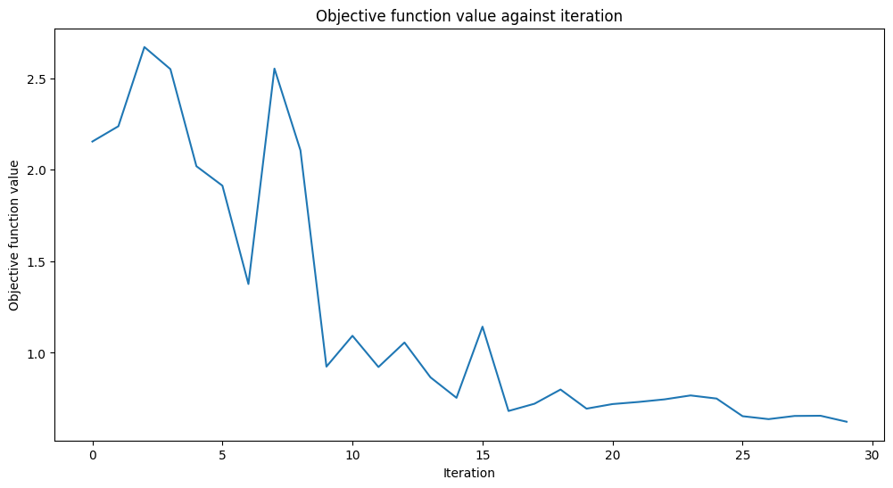
    0.9
Despite we had the low number of iterations, we achieved quite a good
score. Let see the output of the `predict` method and compare the output
with the ground truth.
:::

``` python
predict = vqc.predict(X)
print(f"Predicted labels: {predict}")
print(f"Ground truth:     {y_cat}")
```

    Predicted labels: ['A' 'A' 'B' 'C' 'C' 'A' 'B' 'B' 'A' 'B']
    Ground truth:     ['A' 'A' 'B' 'C' 'C' 'A' 'B' 'B' 'A' 'C']


## Regression

We prepare a simple regression dataset to illustrate the following
algorithms.
``` python
num_samples = 20
eps = 0.2
lb, ub = -np.pi, np.pi
X_ = np.linspace(lb, ub, num=50).reshape(50, 1)
f = lambda x: np.sin(x)

X = (ub - lb) * algorithm_globals.random.random([num_samples, 1]) + lb
y = f(X[:, 0]) + eps * (2 * algorithm_globals.random.random(num_samples) - 1)

plt.plot(X_, f(X_), "r--")
plt.plot(X, y, "bo")
plt.show()
```

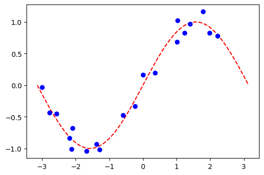

### Regression with an `EstimatorQNN`

Here we restrict to regression with an `EstimatorQNN` that returns
values in $[-1, +1]$. More complex and also multi-dimensional models
could be constructed, also based on `SamplerQNN` but that exceeds the
scope of this tutorial.

``` python
# construct simple feature map
param_x = Parameter("x")
feature_map = QuantumCircuit(1, name="fm")
feature_map.ry(param_x, 0)

# construct simple ansatz
param_y = Parameter("y")
ansatz = QuantumCircuit(1, name="vf")
ansatz.ry(param_y, 0)

# construct a circuit
qc = QNNCircuit(feature_map=feature_map, ansatz=ansatz)

# construct QNN
regression_estimator_qnn = EstimatorQNN(circuit=qc, estimator=estimator)
```
``` python
# construct the regressor from the neural network
regressor = NeuralNetworkRegressor(
    neural_network=regression_estimator_qnn,
    loss="squared_error",
    optimizer=L_BFGS_B(maxiter=5),
    callback=callback_graph,
)
```
``` python
# create empty array for callback to store evaluations of the objective function
objective_func_vals = []
plt.rcParams["figure.figsize"] = (12, 6)

# fit to data
regressor.fit(X, y)

# return to default figsize
plt.rcParams["figure.figsize"] = (6, 4)

# score the result
regressor.score(X, y)
```

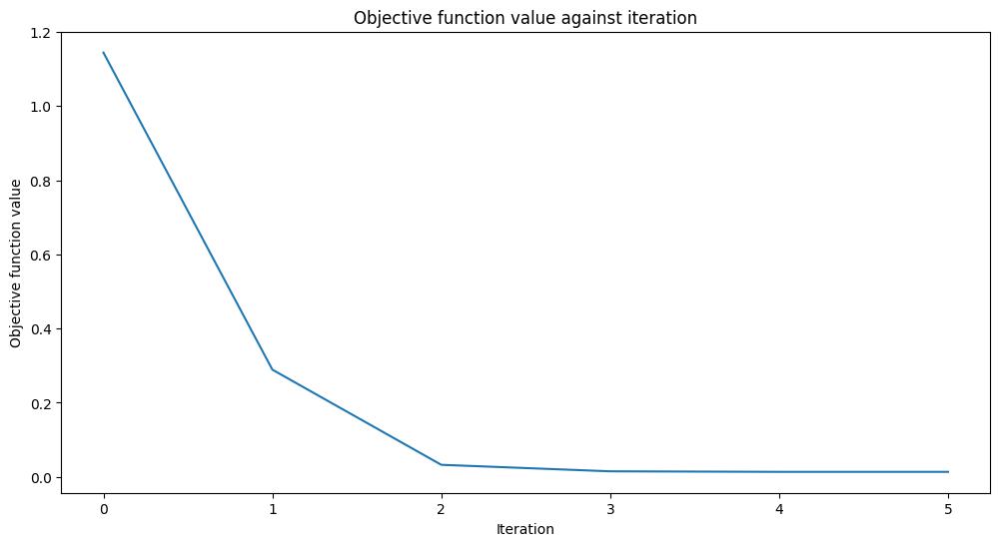
    0.9769994291935522
``` python
# plot target function
plt.plot(X_, f(X_), "r--")

# plot data
plt.plot(X, y, "bo")

# plot fitted line
y_ = regressor.predict(X_)
plt.plot(X_, y_, "g-")
plt.show()
```


Similarly to the classification models, we can obtain an array of
trained weights by querying a corresponding property of the model. In
this model we have only one parameter defined as `param_y` above.
``` python
regressor.weights
```

    array([-1.58870599])

### Regression with the Variational Quantum Regressor (`VQR`)

Similar to the `VQC` for classification, the `VQR` is a special variant
of the `NeuralNetworkRegressor` with a `EstimatorQNN`. By default it
considers the `L2Loss` function to minimize the mean squared error
between predictions and targets.

``` python
vqr = VQR(
    feature_map=feature_map,
    ansatz=ansatz,
    optimizer=L_BFGS_B(maxiter=5),
    callback=callback_graph,
    estimator=estimator,
)
```

``` python
# create empty array for callback to store evaluations of the objective function
objective_func_vals = []
plt.rcParams["figure.figsize"] = (12, 6)

# fit regressor
vqr.fit(X, y)

# return to default figsize
plt.rcParams["figure.figsize"] = (6, 4)

# score result
vqr.score(X, y)
```

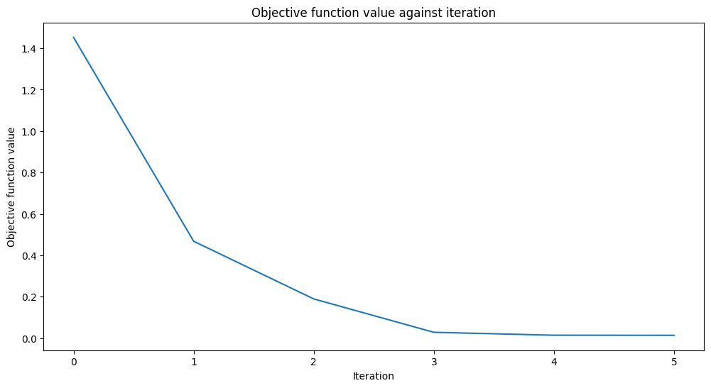
    0.9769955693935384
``` python
# plot target function
plt.plot(X_, f(X_), "r--")

# plot data
plt.plot(X, y, "bo")

# plot fitted line
y_ = vqr.predict(X_)
plt.plot(X_, y_, "g-")
plt.show()
```

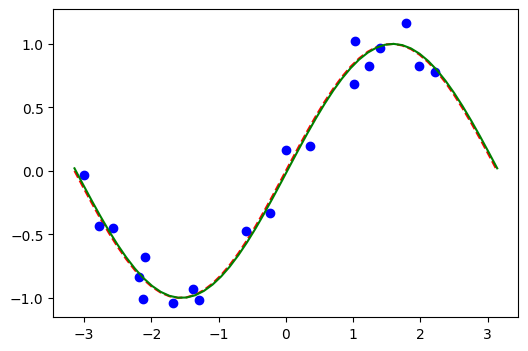

### More examples

Learning path notebooks may be found in the
[Machine Learning tutorials](https://qiskit-community.github.io/qiskit-machine-learning/tutorials/index.html) section
of the documentation and are a great place to start. 

## License

This project uses the [Apache License 2.0](https://github.com/qiskit-community/qiskit-machine-learning/blob/main/LICENSE.txt).
